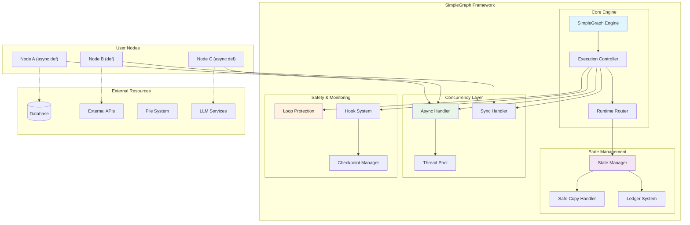
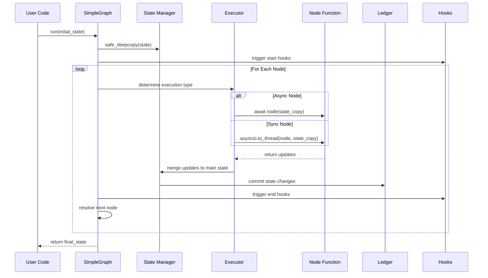
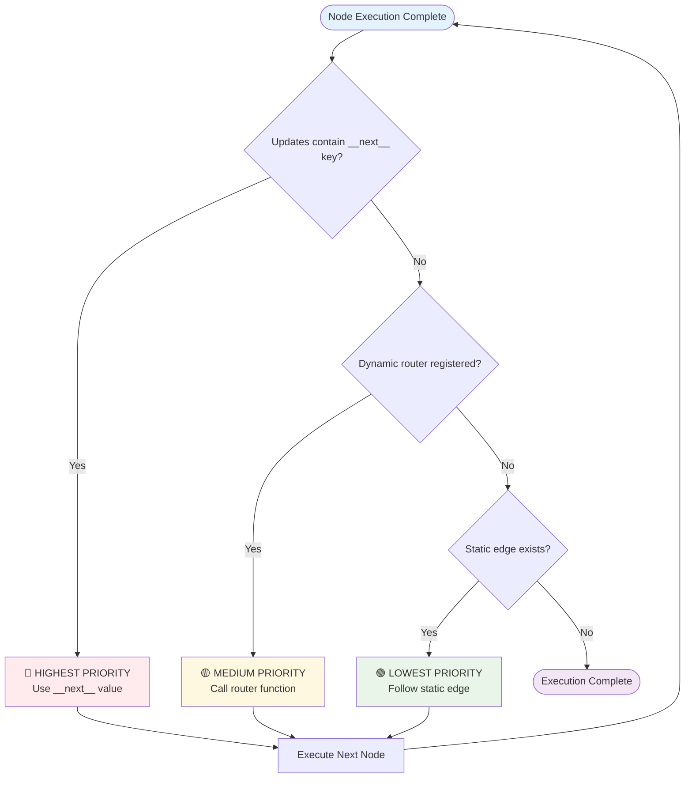
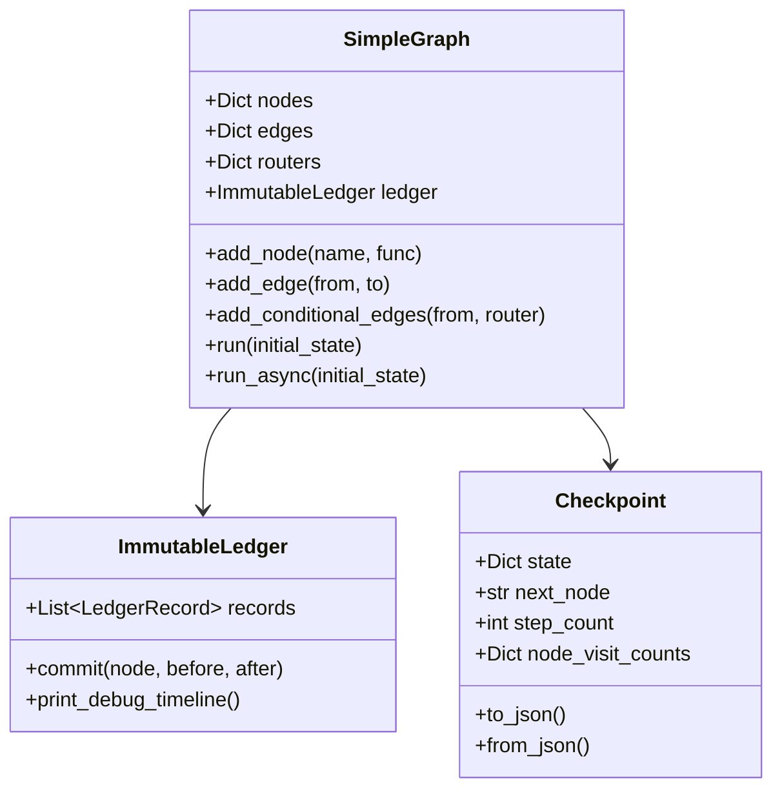
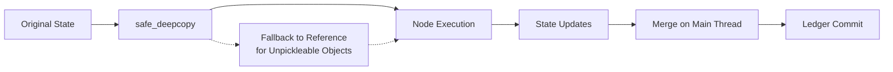
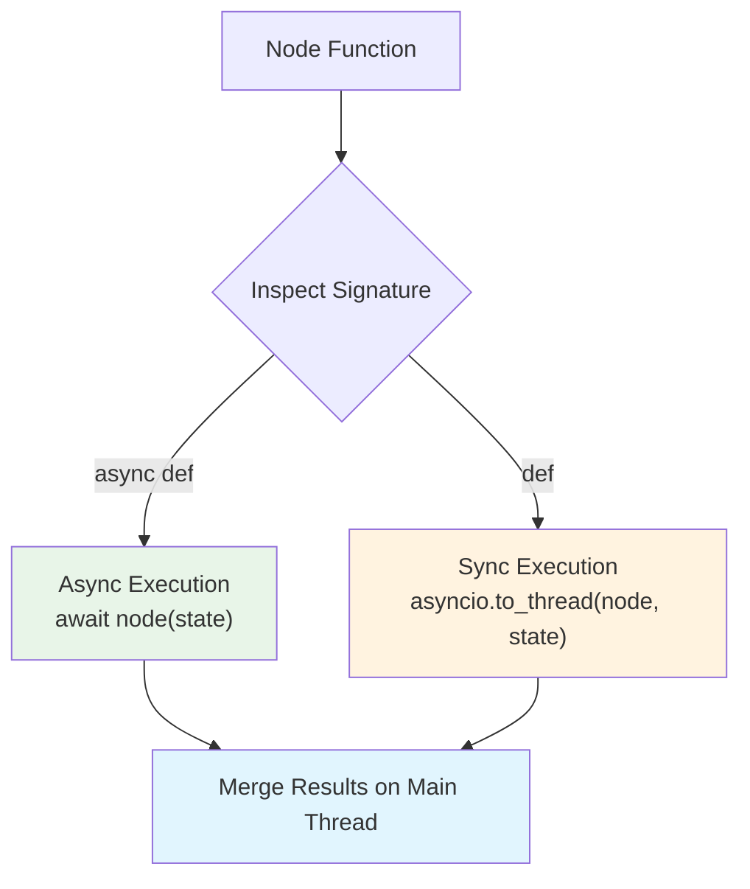

# SimpleGraph 🕸️

[](https://python.org)
[](https://opensource.org/licenses/MIT)
[](https://github.com/psf/black)
[](https://github.com/skarthi369/simple-graph)

**SimpleGraph** is an ultra-simple, concurrent, transparent, and highly customizable multi-agent orchestration framework for Python. 

Unlike complex, heavy multi-agent libraries that impose mandatory graph compilation steps, specialized custom channels, or state reducers, **SimpleGraph** prioritizes **Absolute Simplicity** and **Zero Cognitive Friction**. It handles multi-agent orchestration using standard Python dictionaries, sequential execution flows, dynamic runtime routing, and robust built-in safeguards.

## 🏗️ Architecture Overview

SimpleGraph follows a clean, modular architecture designed for maximum flexibility and minimal complexity:



## 🔄 Execution Flow Architecture



## 🎯 Routing Priority System

SimpleGraph uses a sophisticated three-tier routing system:



## 📋 Table of Contents

- [Architecture Overview](#️-architecture-overview)
- [Execution Flow](#-execution-flow-architecture)
- [Routing System](#-routing-priority-system)
- [Key Features](#key-features)
- [Installation](#installation)
- [Quick Start](#quickstart-cyclic-math-workflow-non-llm)
- [Advanced Usage](#advanced-asynchronous-writer-reviewer-flow-llm-client-with-locks)
- [Architecture Deep Dive](#-architecture-deep-dive)
- [API Reference](#-api-reference)
- [Best Practices](#-best-practices)
- [Performance Considerations](#-performance-considerations)
- [Contributing](#-contributing)
- [License](#license)

---

## 🔧 Architecture Deep Dive

### Core Components Explained

#### 1. **SimpleGraph Engine**
The central orchestrator that manages the entire execution lifecycle. It maintains node registry, routing logic, and coordinates between all subsystems.



#### 2. **State Management System**
Thread-safe state handling with intelligent deep-copying that gracefully handles unpickleable objects.



#### 3. **Polymorphic Concurrency Layer**
Automatic detection and handling of sync/async node functions with thread pool offloading.



### Thread Safety Guarantees

SimpleGraph ensures thread safety through several mechanisms:

1. **State Isolation**: Each node receives a deep copy of the state
2. **Main Thread Merging**: All state updates are merged exclusively on the main event loop thread
3. **Immutable Ledger**: Historical records are append-only and never modified
4. **Reference Sharing**: Unpickleable objects (locks, clients) are safely shared by reference

---

## 📚 API Reference

### Core Classes

#### `SimpleGraph`

The main orchestration engine for multi-agent workflows.

**Constructor**
```python
graph = SimpleGraph()
```

**Methods**

| Method | Description | Parameters | Returns |
|--------|-------------|------------|---------|
| `add_node(name, func)` | Register a node function | `name: str`, `func: Callable` | `SimpleGraph` |
| `add_edge(from_node, to_node)` | Add static routing edge | `from_node: str`, `to_node: str` | `SimpleGraph` |
| `add_conditional_edges(from_node, router_func)` | Add dynamic routing | `from_node: str`, `router_func: Callable` | `SimpleGraph` |
| `set_entry_point(name)` | Set starting node | `name: str` | `SimpleGraph` |
| `run(initial_state, **kwargs)` | Execute synchronously | `initial_state: Dict`, `max_steps: int`, `custom_node_limits: Dict` | `Dict` |
| `run_async(initial_state, **kwargs)` | Execute asynchronously | `initial_state: Dict`, `max_steps: int`, `custom_node_limits: Dict` | `Dict` |
| `resume(checkpoint, **kwargs)` | Resume from checkpoint | `checkpoint: Checkpoint`, `max_steps: int`, `custom_node_limits: Dict` | `Dict` |
| `resume_async(checkpoint, **kwargs)` | Resume asynchronously | `checkpoint: Checkpoint`, `max_steps: int`, `custom_node_limits: Dict` | `Dict` |

#### `Checkpoint`

Serializable execution state snapshot for pause/resume functionality.

**Constructor**
```python
checkpoint = Checkpoint(
    state=current_state,
    next_node="node_name",
    step_count=5,
    node_visit_counts={"node1": 2, "node2": 3}
)
```

**Methods**

| Method | Description | Returns |
|--------|-------------|---------|
| `to_dict()` | Convert to dictionary | `Dict` |
| `to_json()` | Serialize to JSON string | `str` |
| `from_dict(data)` | Create from dictionary | `Checkpoint` |
| `from_json(json_str)` | Deserialize from JSON | `Checkpoint` |

### Exception Classes

| Exception | Description | When Raised |
|-----------|-------------|-------------|
| `InfiniteLoopError` | Loop protection triggered | Step or node visit limits exceeded |
| `PauseExecution` | Graceful execution pause | Raised by nodes or hooks to pause execution |

---

## 🎯 Best Practices

### 1. Node Function Design

**✅ Good Practice**
```python
def well_designed_node(state: dict) -> dict:
    """Process user data and return partial state updates."""
    user_id = state.get("user_id")
    if not user_id:
        return {"error": "Missing user_id"}
    
    # Process data
    result = process_user_data(user_id)
    
    # Return only what changed
    return {
        "processed_data": result,
        "last_processed": datetime.utcnow().isoformat()
    }
```

**❌ Avoid**
```python
def poorly_designed_node(state):
    # Don't mutate input state directly
    state["data"] = "modified"  # ❌ Bad
    
    # Don't return entire state
    return state  # ❌ Bad
    
    # Don't ignore type hints
    return "not a dict"  # ❌ Bad
```

### 2. Error Handling

**✅ Robust Error Handling**
```python
def resilient_node(state: dict) -> dict:
    try:
        result = risky_operation(state["input"])
        return {"result": result, "status": "success"}
    except SpecificError as e:
        return {"error": str(e), "status": "failed", "__next__": "error_handler"}
    except Exception as e:
        logger.exception("Unexpected error in node")
        return {"error": "Internal error", "status": "failed"}
```

### 3. State Design Patterns

**✅ Recommended State Structure**
```python
initial_state = {
    # Core data
    "user_id": "12345",
    "request_data": {...},
    
    # Workflow metadata
    "workflow_id": uuid4().hex,
    "started_at": datetime.utcnow().isoformat(),
    
    # Status tracking
    "current_step": "validation",
    "completed_steps": [],
    "errors": [],
    
    # External resources (unpickleable objects)
    "db_client": database_client,
    "llm_client": openai_client,
}
```

### 4. Routing Strategies

**Dynamic Routing Example**
```python
def smart_router(state: dict) -> str:
    """Route based on state conditions."""
    if state.get("error"):
        return "error_handler"
    elif state.get("requires_approval"):
        return "human_review"
    elif state.get("confidence_score", 0) < 0.8:
        return "additional_validation"
    else:
        return "finalize"

graph.add_conditional_edges("processor", smart_router)
```

---

## ⚡ Performance Considerations

### Memory Management

1. **State Size**: Keep state dictionaries reasonably sized. Large objects should be stored externally and referenced by ID.

2. **Ledger Growth**: The ledger grows with each step. For long-running workflows, consider periodic cleanup:
```python
# Clear ledger history if needed
if len(graph.ledger.records) > 1000:
    graph.ledger.records = graph.ledger.records[-100:]  # Keep last 100
```

3. **Deep Copy Optimization**: Unpickleable objects are automatically handled by reference sharing, reducing memory overhead.

### Concurrency Optimization

```python
# Optimize for I/O bound operations
async def io_heavy_node(state: dict) -> dict:
    async with aiohttp.ClientSession() as session:
        # Multiple concurrent requests
        tasks = [
            fetch_data(session, url) 
            for url in state["urls"]
        ]
        results = await asyncio.gather(*tasks)
    return {"results": results}

# CPU-bound operations automatically use thread pool
def cpu_heavy_node(state: dict) -> dict:
    # This runs in background thread automatically
    return {"result": expensive_computation(state["data"])}
```

### Loop Protection Tuning

```python
# Configure limits based on your use case
final_state = graph.run(
    initial_state,
    max_steps=500,  # Global step limit
    custom_node_limits={
        "retry_node": 5,      # Allow max 5 retries
        "validation": 10,     # Allow max 10 validation attempts
        "llm_call": 3         # Limit LLM calls to prevent cost overrun
    }
)
```

---

## 🧪 Testing Strategies

### Unit Testing Nodes

```python
def test_processor_node():
    # Test with minimal state
    state = {"input": "test_data"}
    result = processor_node(state)
    
    assert result["status"] == "processed"
    assert "output" in result

def test_error_handling():
    # Test error conditions
    state = {"input": None}
    result = processor_node(state)
    
    assert result["status"] == "error"
    assert "error" in result
```

### Integration Testing

```python
@pytest.mark.asyncio
async def test_full_workflow():
    graph = SimpleGraph()
    # ... setup graph ...
    
    initial_state = {"test": True}
    final_state = await graph.run_async(initial_state)
    
    # Verify end-to-end behavior
    assert final_state["completed"] is True
    assert len(graph.ledger.records) == expected_steps
```

---

## 🤝 Contributing

We welcome contributions! Please see our [Contributing Guidelines](CONTRIBUTING.md) for details.

### Development Setup

```bash
# Clone the repository
git clone https://github.com/skarthi369/simple-graph.git
cd simple-graph

# Install in development mode
pip install -e .

# Install development dependencies
pip install pytest pytest-asyncio black flake8

# Run tests
pytest tests/ -v

# Format code
black src/ tests/ examples/
```

### Code Quality Standards

- **Type Hints**: All public functions must have type hints
- **Documentation**: Docstrings required for all public methods
- **Testing**: Minimum 90% test coverage for new features
- **Code Style**: Black formatting with 88-character line limit

---

## Key Features

1. ⚡ **Zero-Boilerplate State Management:** Entire state is a standard Python flat dictionary. Agents simply return partial updates, which the core engine merges seamlessly.
2. 🔀 **Dynamic Runtime Routing:** No compilation phase. Flow execution is computed dynamically at runtime using a strict routing priority.
3. 🧵 **Polymorphic Concurrency:** Mixing synchronous and asynchronous agents? SimpleGraph inspects your agent signatures and automatically offloads blocking synchronous nodes to background threads (`asyncio.to_thread`) without blocking the event loop.
4. 🔒 **Thread-Safe Merging:** State updates from background worker threads are consolidated and merged exclusively on the main event loop thread, completely eliminating data write race conditions.
5. 🛡️ **Safe Deep-Copy & Diffing:** The local tracking engine deep-copies state before and after each node run to calculate exact key diffs. It gracefully falls back to reference sharing when un-pickleable objects (like LLM clients, database handles, or thread locks) are stored in the state.
6. 🕵️ **Time-Travel Visual Debugger:** A built-in terminal ledger that records all mutations and renders a gorgeous, colorized timeline showing exactly who mutated what, and when.
7. 💾 **Structured Checkpoints & Pause/Resume:** Interceptor hooks can pause execution and export a full `Checkpoint` object (state + pointer + history metadata), enabling seamless serializable pause-and-resume workflows.
8. 🔄 **Dynamic Loop Protection:** Loop and step thresholds can be configured globally or per-node to safely handle writer-reviewer cycles.

---

## Installation

You can install SimpleGraph locally in editable mode during development:

```bash
pip install -e .
```

---

## Quickstart: Cyclic Math Workflow (Non-LLM)

Below is an elegant, non-LLM cyclic calculation flow:

```python
from simplegraph import SimpleGraph

# 1. Define simple nodes accepting and returning partial state dictionaries
def initiator(state: dict) -> dict:
    return {"number": 10}

def multiplier(state: dict) -> dict:
    return {"number": state["number"] * 2}

def checker(state: dict) -> dict:
    # Use "__next__" to override flow dynamically
    if state["number"] < 50:
        return {"__next__": "multiplier"}
    return {"status": "success", "__next__": None}

# 2. Setup the graph
graph = SimpleGraph()
graph.add_node("initiator", initiator)
graph.add_node("multiplier", multiplier)
graph.add_node("checker", checker)

# Connect static edges
graph.add_edge("initiator", "multiplier")
graph.add_edge("multiplier", "checker")

graph.set_entry_point("initiator")

# 3. Run execution and print the timeline
final_state = graph.run({})
graph.ledger.print_debug_timeline()
```

---

## Advanced: Asynchronous Writer-Reviewer Flow (LLM Client with Locks)

SimpleGraph seamlessly supports complex LLM workflows containing asynchronous routines and un-pickleable objects (e.g. locks, database handles, API clients):

```python
import asyncio
import threading
from simplegraph import SimpleGraph

class MockLLMClient:
    def __init__(self):
        self.lock = threading.Lock()  # Famously uncopyable
    
    def query(self, prompt: str) -> str:
        return "SimpleGraph is an elegant orchestration framework."

async def writer_agent(state: dict) -> dict:
    client = state["llm_client"]
    # ... async call ...
    await asyncio.sleep(0.01)
    return {"draft": client.query("Write essay")}

def reviewer_agent(state: dict) -> dict:
    # Synchronous blocking review logic, auto-offloaded to background thread pool
    draft = state["draft"]
    return {"approved": True, "__next__": None}

async def main():
    graph = SimpleGraph()
    graph.add_node("writer", writer_agent)
    graph.add_node("reviewer", reviewer_agent)
    graph.add_edge("writer", "reviewer")
    graph.set_entry_point("writer")

    initial_state = {
        "llm_client": MockLLMClient(),
        "draft": "",
        "approved": False
    }

    final_state = await graph.run_async(initial_state)
    graph.ledger.print_debug_timeline()

asyncio.run(main())
```

---

## Under the Hood: Routing Precedence

When deciding which node to transition to next, the orchestrator follows this exact priority hierarchy:

1. **Highest:** Override returned in the dictionary payload using the special `__next__` key (e.g., `return {"val": 42, "__next__": "custom_node"}`).
2. **Medium:** Dynamic routing functions registered via `add_conditional_edges("from_node", router_func)`.
3. **Lowest:** Static edges defined with `add_edge("from_node", "to_node")`.

---

## License

This project is licensed under the MIT License.
