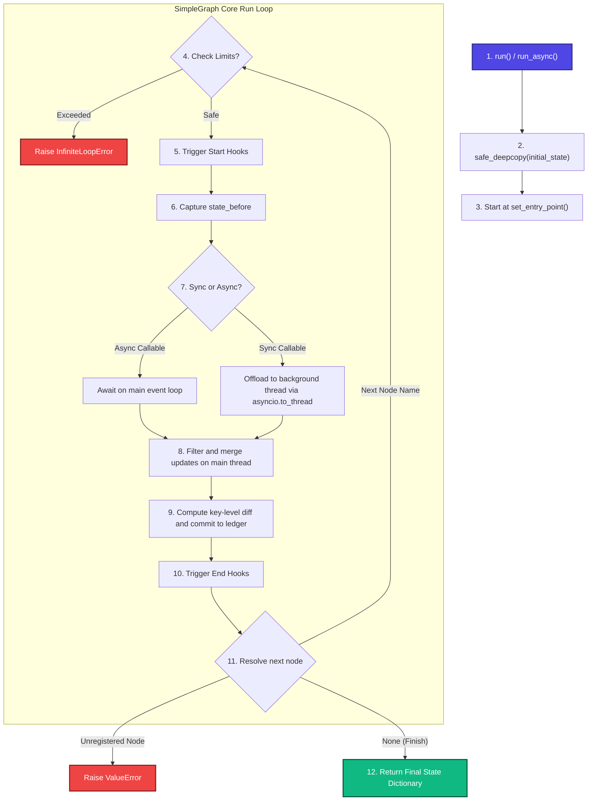
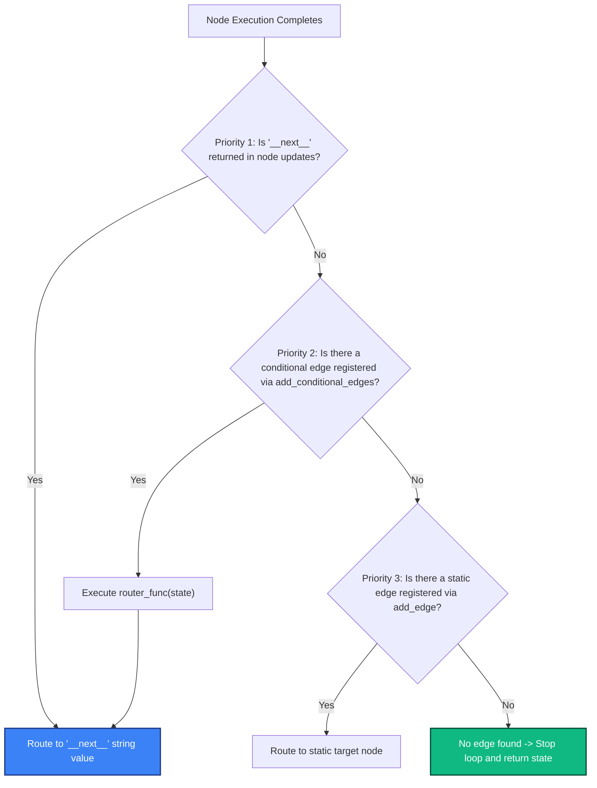
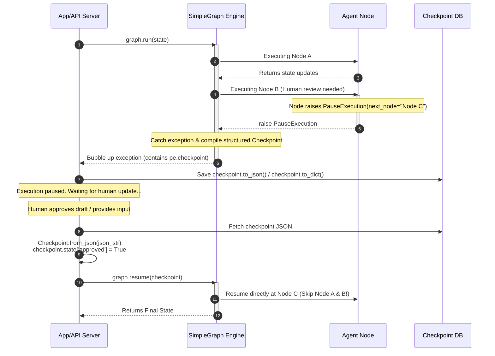

# SimpleGraph User Manual 🕸️
### *The developer-first alternative to LangGraph: Absolute Simplicity, Total Transparency, and Zero Cognitive Friction.*

Welcome to the **SimpleGraph** User Manual! This guide is designed to serve as both a quickstart tutorial and a deep-dive technical reference. It teaches you how to build, run, customize, and integrate Large Language Models (LLMs) with SimpleGraph, and explains why SimpleGraph is the ideal framework for building robust, production-ready multi-agent workflows.

---

## 1. Why SimpleGraph instead of LangGraph?

While **LangGraph** (by LangChain) is a powerful framework, it introduces significant complexity and strict architectural constraints. Developers often spend more time fighting the framework's abstractions than writing agent logic. 

Here is why developers choose **SimpleGraph**:

| Aspect | LangGraph | SimpleGraph 🕸️ |
|---|---|---|
| **Compilation Phase** | **Mandatory Compilation:** Requires a strict `.compile()` step. Dynamic alterations of the graph at runtime are complex and restricted. | **Zero Compilation:** The graph remains fully dynamic and inspectable. Run loops are evaluated directly on Python primitives at execution time. |
| **State Management** | **Channels & State Reducers:** Requires defining specialized state schemas, Custom Channels, and manual Reducer functions to merge state keys. | **Pure Python Dictionaries:** The state is a standard, flat Python dictionary. Nodes return simple partial updates (e.g. `{"score": 9}`) that are merged automatically. |
| **Un-pickleable State Safety** | **Crashes on Uncopyable Fields:** LangGraph's internal state management relies on strict serialization/pickling. Storing active database handles, network sockets, thread locks, or SDK clients often crashes the execution loop. | **Safe Deep-Copy Fallback:** Implements recursive `safe_deepcopy`. If a complex object (like an SDK client with active locks) cannot be deep-copied, it falls back to thread-safe reference sharing automatically. |
| **Concurrency & Thread Safety** | **Complex Async/Sync Overhead:** Developers must manually wrap synchronous blocking calls or orchestrate complex thread executors to avoid locking the event loop. | **Polymorphic Concurrency:** SimpleGraph inspects your function signatures at runtime. Synchronous nodes are automatically offloaded to worker threads (`asyncio.to_thread`) while state merging is kept strictly on the main thread. |
| **Debug Visibility** | **Proprietary UI / Complex Tracing:** Visualizing state mutations step-by-step requires external SaaS platforms (LangSmith) or verbose custom callbacks. | **Time-Travel Visual Debugger:** A built-in terminal ledger that traces key-level mutations (`added`, `modified`, `deleted`) and prints a gorgeous, colorized timeline out-of-the-box. |

---

## 2. Core Architecture & Workflow Execution

At its heart, **SimpleGraph** is a state machine that executes registered node callables and determines transitions dynamically using a priority queue.

### How it Works (Under the Hood)


### Dynamic Routing Hierarchy
When a node finishes executing, SimpleGraph determines where to navigate next by evaluating three options in this exact order:



---

## 3. How to Use & Customize the Framework

### Standard Setup and Initialization
Building a graph involves registering node functions, setting up static or dynamic transitions, setting the starting node, and executing.

```python
from simplegraph import SimpleGraph

# 1. Define node functions
def start_node(state: dict) -> dict:
    print("Executing start_node...")
    return {"counter": state.get("counter", 0) + 1}

def second_node(state: dict) -> dict:
    print("Executing second_node...")
    return {"counter": state["counter"] + 10}

# 2. Initialize and configure the graph
graph = SimpleGraph()
graph.add_node("start", start_node)
graph.add_node("second", second_node)

# Connect nodes
graph.add_edge("start", "second")
graph.set_entry_point("start")

# 3. Execute
final_state = graph.run({"counter": 5})
print(f"Final state: {final_state}")
```

### Customizing Node Transitions (Dynamic Routing)
To direct the flow conditionally, you can use `add_conditional_edges` or return a dynamic `__next__` key.

```python
# Option A: Conditional Edge / Router Function
def my_router(state: dict) -> str:
    if state["score"] >= 80:
        return "accept_node"
    return "revise_node"

graph.add_conditional_edges("evaluate_node", my_router)

# Option B: Inline Node Override (Highest Priority)
def evaluator(state: dict) -> dict:
    if state["score"] >= 80:
        return {"__next__": "accept_node"} # Overrides static or conditional edges
    return {"__next__": "revise_node"}
```

### Registering Lifecycle Interceptors (Hooks)
Hooks allow you to monitor, log, or inject actions before a node starts and after a node completes. SimpleGraph provides `register_on_node_start` and `register_on_node_end`.

```python
def my_start_hook(node_name: str, state: dict):
    print(f"🚀 Preparing to execute node: {node_name}")

def my_end_hook(node_name: str, state: dict, updates: dict, diff: dict):
    print(f"✅ Finished {node_name}. Updates: {updates}")
    if diff["modified"]:
        print(f"   Mutated keys: {list(diff['modified'].keys())}")

graph.register_on_node_start(my_start_hook)
graph.register_on_node_end(my_end_hook)
```

---

## 4. Integrating Large Language Models (LLMs)

Integrating LLMs into multi-agent systems often requires preserving active client handles, managing tool-use state loops, and executing complex thread-blocking API calls. SimpleGraph makes this effortless.

### Safe LLM Client Storage in Graph State
Because SimpleGraph features a recursive `safe_deepcopy` mechanism, you can safely store active LLM SDK clients (which often contain un-pickleable HTTP pools or thread locks) directly in your central graph state!

### Production-Ready Example: Collaborative Writer-Reviewer Loop
Here is a fully functional asynchronous multi-agent application simulating a collaborative writing loop using OpenAI-like client patterns.

```python
import asyncio
import threading
from simplegraph import SimpleGraph

# 1. Standard Client wrapping complex/un-copyable dependencies
class ProductionLLMClient:
    def __init__(self, api_key: str):
        self.api_key = api_key
        self.lock = threading.Lock()  # Standard copy.deepcopy() would crash here!
    
    def generate(self, prompt: str) -> str:
        # Simulates blocking network SDK query
        with self.lock:
            return f"[Generated Text] based on prompt: '{prompt}'"

# 2. Define Asynchronous Agent Nodes
async def researcher_agent(state: dict) -> dict:
    client = state["llm_client"]
    # Simulating non-blocking async operations
    await asyncio.sleep(0.05)
    query_prompt = f"Key research points for: {state['topic']}"
    points = client.generate(query_prompt)
    return {"research_data": points}

async def writer_agent(state: dict) -> dict:
    client = state["llm_client"]
    await asyncio.sleep(0.02)
    draft_prompt = f"Write an article using this research: {state['research_data']}"
    article = client.generate(draft_prompt)
    return {"draft": article}

# 3. Define Synchronous Agent Node (Auto-Offloaded to Background Threads!)
def reviewer_agent(state: dict) -> dict:
    # Synchronous blocking review logic
    draft = state["draft"]
    score = 75 if "research" not in draft.lower() else 95
    feedback = "Add more facts" if score < 90 else "Excellent draft!"
    
    # SimpleGraph will offload this function to asyncio.to_thread under-the-hood,
    # ensuring the main event loop never blocks during execution.
    return {
        "score": score,
        "feedback": feedback,
        "iterations": state.get("iterations", 0) + 1
    }

# 4. Router logic
def routing_decision(state: dict) -> str:
    if state["score"] >= 90:
        return "publish_node"
    if state["iterations"] >= 3:
        return "publish_node" # Cycle protection fallback
    return "writer_node"

def publisher_node(state: dict) -> dict:
    return {"status": "published"}

# 5. Asynchronous Graph Assembly and Execution
async def main():
    graph = SimpleGraph()
    
    # Register agents
    graph.add_node("researcher", researcher_agent)
    graph.add_node("writer", writer_agent)
    graph.add_node("reviewer", reviewer_agent)
    graph.add_node("publisher", publisher_node)
    
    # Connect edges
    graph.add_edge("researcher", "writer")
    graph.add_edge("writer", "reviewer")
    graph.add_conditional_edges("reviewer", routing_decision)
    graph.add_edge("publisher", None) # Terminates execution
    
    graph.set_entry_point("researcher")
    
    # Define initial state holding our complex, un-pickleable LLM client
    initial_state = {
        "topic": "Thread-safe multi-agent systems",
        "llm_client": ProductionLLMClient(api_key="sk-prod-12345"),
        "research_data": "",
        "draft": "",
        "score": 0,
        "iterations": 0
    }
    
    # Run the polymorphic graph
    print(">>> Executing Multi-Agent workflow...")
    final_state = await graph.run_async(initial_state, max_steps=20)
    
    # Renders the beautiful state mutation timeline
    graph.ledger.print_debug_timeline()
    print(f"Workflow Finished! Final Score: {final_state['score']}")

if __name__ == "__main__":
    asyncio.run(main())
```

---

## 5. Human-in-the-Loop & State Checkpointing

In advanced agentic systems, you often need to pause execution (e.g. to wait for human review, tool confirmations, or third-party webhooks) and resume it later. 

SimpleGraph natively supports this pattern with `PauseExecution` exceptions and serializable JSON `Checkpoint` snapshots.

### Flowchart: Pause and Resume Architecture


### Implementing Pause & Resume in Code
Here is how easily you can implement this pattern:

```python
import json
from simplegraph import SimpleGraph, PauseExecution, Checkpoint

# 1. Define nodes
def content_writer(state: dict) -> dict:
    return {"draft": "SimpleGraph is incredibly powerful."}

def human_approval_node(state: dict) -> dict:
    # If not approved, pause execution and instruct engine to resume at 'publisher'
    if not state.get("approved", False):
        raise PauseExecution("Waiting for admin approval", next_node="publisher")
    return state

def publisher(state: dict) -> dict:
    return {"status": "published", "live_draft": state["draft"]}

# 2. Setup graph
graph = SimpleGraph()
graph.add_node("writer", content_writer)
graph.add_node("approval", human_approval_node)
graph.add_node("publisher", publisher)

graph.add_edge("writer", "approval")
graph.add_edge("approval", "publisher")
graph.set_entry_point("writer")

# 3. Run execution (will trigger pause)
checkpoint_store = None
try:
    graph.run({"approved": False})
except PauseExecution as pe:
    print(f"⚠️ Graph paused: {pe}")
    # retrieve the auto-built checkpoint packed into the exception
    checkpoint_store = pe.checkpoint

# 4. Serialize the checkpoint to JSON (e.g. for database storage)
serialized_json = checkpoint_store.to_json()
print("Checkpoint persisted to JSON database.")

# --- Later, on API Event / Admin Approval ---

# 5. Load and deserialize checkpoint
restored_checkpoint = Checkpoint.from_json(serialized_json)

# Modify/Update state inside checkpoint with the human input
restored_checkpoint.state["approved"] = True

# 6. Resume execution from the checkpoint seamlessly!
final_state = graph.resume(restored_checkpoint)
print(f"Graph execution complete! Status: {final_state['status']}")
```

---

## 6. Best Practices for Production

1. **Leverage the Debug Timeline during Testing:** Always invoke `graph.ledger.print_debug_timeline()` at the end of your test suites to visually inspect how your state changes and make sure no unexpected keys are mutated.
2. **Prevent Infinite Agent Cycles:** Always set a custom step limit (`max_steps`) or per-node limits (`custom_node_limits`) when deploying cycles where LLMs evaluate other LLMs. This will prevent infinite, costly loops.
3. **Isolate Synchronous Code:** Do not use `asyncio` sleep calls or async locks inside sync nodes. Write pure synchronous code, and let SimpleGraph handle the thread offloading for you.
4. **JSON-Safe State Elements:** While un-pickleable objects are safe during execution memory loops, only JSON-serializable keys can be exported in checkpoints. Keep active client handles separate or expect them to be serialized to a safe placeholder string if saved in checkpoints.
